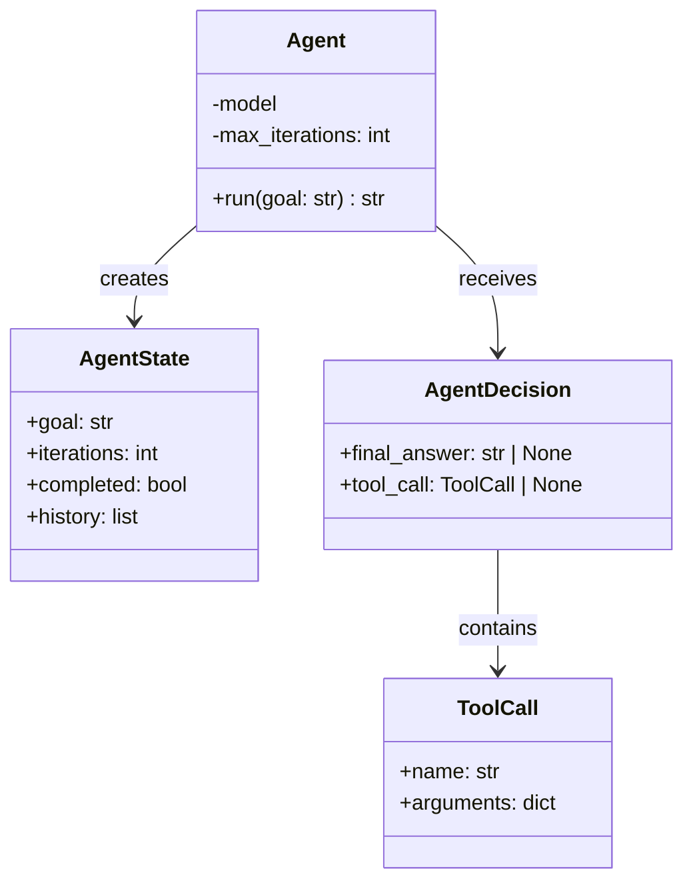
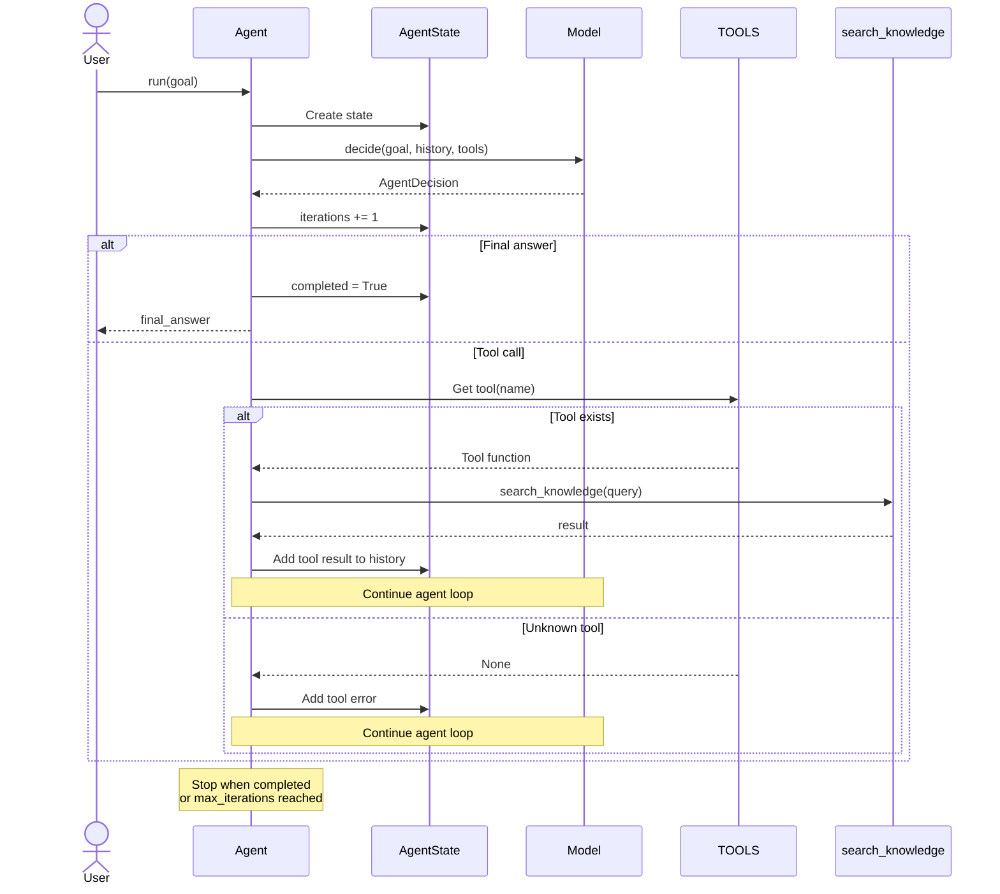

# Anatomy of an AI Agent

A hands-on project for understanding how AI agents work from first principles, without relying on frameworks such as LangChain, LangGraph, or CrewAI.

## Goal

Learn how to design and implement an AI agent by understanding its core components:

* Model
* Instructions
* Context
* Tools
* State
* Control loop
* Guardrails

The project starts with a minimal Python implementation and progressively evolves toward a production-grade agent architecture.

## What Makes an Agent?

An LLM application becomes an agent when the model participates in deciding the execution path.

The core agent cycle is:

**Observe → Decide → Act → Observe → Decide → Finish**

## Core Architecture

### Class Diagram

### Sequence Diagram

## Core Concepts

### Model

The LLM acts as the decision engine and determines what should happen next.

### Instructions

Define the agent's role, responsibilities, constraints, and expected behavior.

### Context

Provides the information the model needs at the current point in execution, such as user requests, documents, policies, conversation history, and tool results.

### Tools

Allow the agent to interact with external systems such as APIs, databases, knowledge bases, and services.

### State

Tracks where the system currently is, including the task phase, iterations, results, and completion status.

### Control Loop

Coordinates model decisions, tool execution, observations, and termination.

### Guardrails

Control what the agent is allowed to do and provide boundaries around execution.

## Workflow vs Agent

A workflow follows a predefined execution path.

An agent allows the model to dynamically determine more of the execution path.

Not every problem requires an agent. Deterministic workflows with targeted AI reasoning are often safer, simpler, and more predictable than fully autonomous agents.

## Production Evolution

The project progressively introduces:

1. LLM
2. Tool use
3. Agent loop
4. State and memory
5. Guardrails
6. Evaluation
7. Observability
8. Enterprise runtime

Production concerns include:

* Authentication
* Authorization
* Validation
* Retries
* Timeouts
* Token and cost budgets
* Human approval
* Evaluation
* Tracing
* Metrics
* Durable execution

## AI Architect Decision Framework

Before building an agent, determine:

1. What is the business goal?
2. Is the process deterministic?
3. Where is reasoning required?
4. What decisions can the LLM make?
5. What tools and data are required?
6. What actions can it perform?
7. What state must persist?
8. What can go wrong?
9. When is human intervention required?
10. How is task completion and success evaluated?

## Final Objective

By completing this project, you should be able to design an AI agent from first principles, implement its core runtime in Python, understand its safety and operational boundaries, and evaluate when an agent architecture is appropriate.
